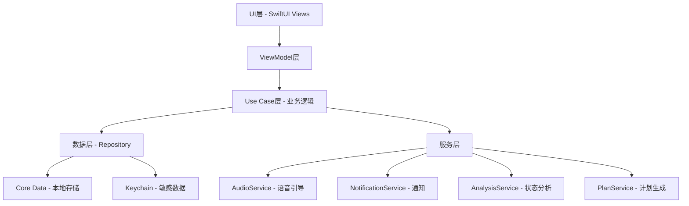
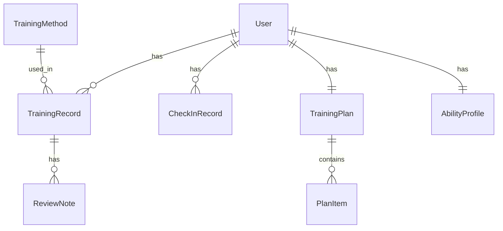

# 设计文档

## 1. 技术架构

### 1.1 技术选型

- **前端技术栈**：SwiftUI + UIKit（混合开发）
- **开发语言**：Swift 5.9+
- **最低支持版本**：iOS 16.0
- **数据存储**：Core Data（本地持久化）+ Keychain（敏感数据）
- **图表库**：SwiftCharts（原生图表框架）
- **音频引擎**：AVFoundation（语音引导）
- **通知服务**：UserNotifications（本地通知）
- **认证服务**：LocalAuthentication（Face ID/Touch ID）
- **架构模式**：MVVM + Clean Architecture

### 1.2 系统架构



### 1.3 核心模块

| 模块 | 职责 |
|------|------|
| TrainingModule | 训练方法管理、训练内容展示 |
| CoachModule | 实时陪练、语音引导、计时管理 |
| PlanModule | 计划制定、评估问卷、动态调整 |
| CheckInModule | 每日打卡、连续天数、成就系统 |
| ReviewModule | 训练复盘、数据趋势、报告生成 |
| AnalysisModule | 状态分析、能力评分、改善建议 |
| SecurityModule | 隐私保护、数据加密、认证管理 |

## 2. 详细设计

### 2.1 前端设计

#### 2.1.1 页面结构

```
App
├── TabView（主标签栏）
│   ├── 首页（今日概览 + 快捷入口）
│   ├── 训练（训练方法列表 + 详情）
│   ├── 陪练（实时训练界面）
│   ├── 计划（个人计划管理）
│   └── 我的（数据统计 + 设置）
```

#### 2.1.2 核心页面设计

**首页**
- 今日训练任务卡片（含打卡状态）
- 连续打卡天数展示
- 当前能力评分概览
- 快捷开始训练按钮

**训练方法页**
- 训练分类列表（按类型和难度）
- 训练详情页（原理、步骤、注意事项）
- 收藏的训练快速入口

**陪练页**
- 训练模式选择
- 实时计时器（环形进度）
- 呼吸引导动画
- 语音提示状态指示
- 暂停/继续控制

**计划页**
- 当前计划概览
- 计划日历视图
- 计划进度展示
- 计划调整入口

**我的页**
- 能力雷达图
- 训练数据统计
- 复盘报告列表
- 设置（隐私、通知等）

#### 2.1.3 状态管理

使用 SwiftUI 的 @StateObject 和 @EnvironmentObject 管理状态：
- `TrainingViewModel`：训练状态管理
- `CoachViewModel`：陪练状态管理
- `PlanViewModel`：计划状态管理
- `CheckInViewModel`：打卡状态管理
- `AnalysisViewModel`：分析状态管理

### 2.2 数据模型设计

#### 2.2.1 核心实体



#### 2.2.2 数据模型定义

**User（用户）**
- id: UUID
- createdAt: Date
- assessmentCompleted: Bool
- settings: UserData

**TrainingMethod（训练方法）**
- id: UUID
- name: String
- category: TrainingCategory
- difficulty: DifficultyLevel
- description: String
- steps: [TrainingStep]
- duration: TimeInterval
- isFavorite: Bool

**TrainingRecord（训练记录）**
- id: UUID
- methodId: UUID
- date: Date
- duration: TimeInterval
- completionRate: Double
- selfRating: Int
- notes: String

**TrainingPlan（训练计划）**
- id: UUID
- startDate: Date
- endDate: Date
- items: [PlanItem]
- progress: Double

**CheckInRecord（打卡记录）**
- id: UUID
- date: Date
- checkInTime: Date
- trainingRecordId: UUID?

**AbilityProfile（能力档案）**
- id: UUID
- overallScore: Int
- endurance: Double
- control: Double
- recovery: Double
- breathCoordination: Double
- muscleStrength: Double
- level: AbilityLevel
- lastUpdated: Date

### 2.3 业务逻辑设计

#### 2.3.1 训练陪练流程

```
选择训练方法 → 选择训练模式 → 倒计时准备 → 
训练进行中（语音引导+计时+呼吸动画）→ 
训练结束 → 自动记录数据 → 弹出复盘问卷
```

#### 2.3.2 计划生成算法

1. 根据评估问卷计算初始能力等级
2. 基于能力等级匹配训练模板
3. 根据用户目标调整训练强度和频率
4. 生成周期性计划（周/月/季度）
5. 根据训练完成数据动态调整后续计划

#### 2.3.3 状态分析算法

1. 收集近期训练数据（完成度、自评、频率）
2. 计算各维度得分（加权平均）
3. 综合评分 = 各维度加权求和
4. 映射到能力等级
5. 识别低于平均的维度作为薄弱环节
6. 生成个性化改善建议

### 2.4 安全设计

- **数据加密**：Core Data 启用 NSFileProtectionComplete，敏感字段使用 CryptoKit 加密
- **认证机制**：LocalAuthentication 框架实现 Face ID/Touch ID
- **界面保护**：AppDelegate 中监听应用状态切换，进入后台时显示模糊遮罩
- **Keychain 存储**：用户认证令牌等敏感信息存储于 Keychain

### 2.5 目录结构设计

```
ControlTraining/
├── App/
│   ├── ControlTrainingApp.swift
│   └── AppDelegate.swift
├── Modules/
│   ├── Home/
│   │   ├── Views/
│   │   └── ViewModels/
│   ├── Training/
│   │   ├── Views/
│   │   ├── ViewModels/
│   │   └── Models/
│   ├── Coach/
│   │   ├── Views/
│   │   ├── ViewModels/
│   │   └── Services/
│   ├── Plan/
│   │   ├── Views/
│   │   ├── ViewModels/
│   │   └── Services/
│   ├── CheckIn/
│   │   ├── Views/
│   │   └── ViewModels/
│   ├── Review/
│   │   ├── Views/
│   │   └── ViewModels/
│   ├── Analysis/
│   │   ├── Views/
│   │   ├── ViewModels/
│   │   └── Services/
│   └── Settings/
│       ├── Views/
│       └── ViewModels/
├── Core/
│   ├── Data/
│   │   ├── Models/
│   │   ├── Repositories/
│   │   └── CoreDataStack.swift
│   ├── Services/
│   │   ├── AudioService.swift
│   │   ├── NotificationService.swift
│   │   └── SecurityService.swift
│   └── Utilities/
│       ├── Extensions/
│       └── Helpers/
└── Resources/
    ├── Assets.xcassets
    ├── Sounds/
    └── Localizable.strings
```

## 3. 质量保障

### 3.1 测试策略

- **单元测试**：覆盖核心业务逻辑（计划生成算法、状态分析算法）
- **UI测试**：覆盖核心用户流程（训练流程、打卡流程）
- **性能测试**：音频播放性能、数据查询性能

### 3.2 性能优化

- 音频资源预加载，避免训练中卡顿
- Core Data 使用懒加载和分页查询
- 图表数据缓存，避免重复计算

### 3.3 隐私保护措施

- 所有数据本地存储，不上传服务器
- 应用名称和图标不暗示敏感内容
- 截屏时自动模糊敏感界面