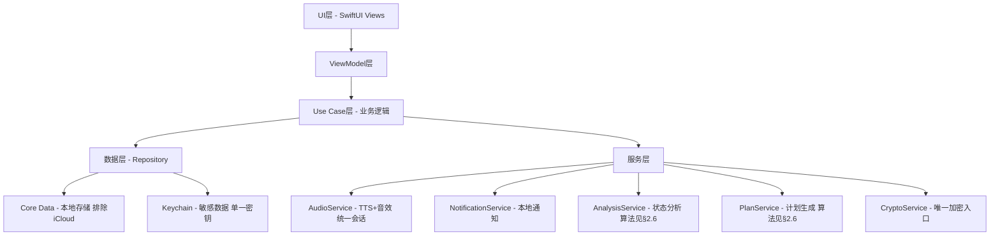
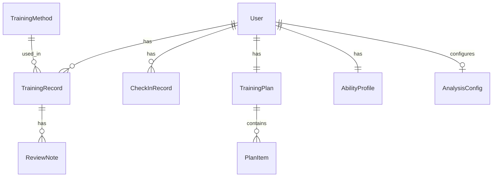

# 设计文档（v2.0 修订版）

> **文档状态**：v2.0（对齐需求文档 v2.0）
> **最后更新**：2026-07-11
> **说明**：本版修订重点——①落地需求 3/6 的算法规格（消除黑盒）；②更正安全设计与代码真实缺陷（BUG-CT-01/03/04/06）的一致性；③补充需求 8/9、合规、无障碍、iCloud 排除的设计；④数据模型补强校验与状态字段。

---

## 1. 技术架构

### 1.1 技术选型

- **前端技术栈**：SwiftUI + UIKit（混合开发）
- **开发语言**：Swift 5.9+
- **最低支持版本**：iOS 16.0
- **数据存储**：Core Data（本地持久化，**排除 iCloud 备份**）+ Keychain（敏感数据）
- **图表库**：SwiftCharts（原生图表框架）
- **音频引擎**：AVFoundation
  - 语音引导：**系统 TTS（`AVSpeechSynthesizer`）实时合成中文（zh-CN）**
  - 关键节点辅以**预录短音效**（Resources/Sounds）
  - 音频会话**统一在 `AudioService` 配置**（`.playback` + `.spokenAudio` + `.duckOthers` + `.allowBluetooth` + `.mixWithOthers`），禁止在 `AppDelegate` 或 `SecurityService` 重复配置（呼应 BUG-CT-06）
- **通知服务**：UserNotifications（本地通知，非推送）
- **认证服务**：LocalAuthentication（Face ID/Touch ID）
- **加密**：CryptoKit AES-256-GCM，**统一由 `CryptoService` 单一密钥入口**（消除 BUG-CT-03 双密钥风险）
- **架构模式**：MVVM + Clean Architecture

### 1.2 系统架构



### 1.3 核心模块

| 模块 | 职责 |
|------|------|
| TrainingModule | 训练方法管理、训练内容展示、收藏 |
| CoachModule | 实时陪练、TTS 语音引导、计时与呼吸动画、部分记录 |
| PlanModule | 计划制定、评估问卷、动态调整 |
| CheckInModule | 每日打卡（有效/补签/部分态）、连续天数、成就 |
| ReviewModule | 训练复盘、数据趋势、报告生成 |
| AnalysisModule | 状态分析（§2.6 加权模型）、能力评分、改善建议 |
| SecurityModule | 隐私保护、单一加密、生物识别、后台模糊 |
| DataModule | 数据导出/导入/彻底删除（**新增，需求 8**） |
| SettingsModule | 设置与无障碍偏好（**新增，需求 9**） |

---

## 2. 详细设计

### 2.1 前端设计

#### 2.1.1 页面结构

```
App
├── TabView（主标签栏）
│   ├── 首页（今日概览 + 快捷入口 + 打卡）
│   ├── 训练（训练方法列表 + 详情 + 收藏）
│   ├── 陪练（实时训练界面）
│   ├── 计划（个人计划管理）
│   ├── 复盘（历史记录 + 趋势 + 报告）   ← 独立一级入口
│   └── 我的（能力雷达图 + 数据统计 + 设置 + 数据管理 + 合规页）
```

> 变更点：复盘(Review) 提升为独立 Tab（原设计隐藏于「我的」可达性弱）；数据管理、合规页归入「我的」。

#### 2.1.2 核心页面设计

**首页**：今日训练任务卡片（含打卡状态）、连续打卡天数、当前能力评分概览、快捷开始训练按钮。

**训练方法页**：分类列表（类型+难度筛选）、详情页（原理/步骤图解/注意事项/**禁忌人群 AC-C.5**/**来源标注 AC-C.2**）、收藏入口（≤2 次点击）。

**陪练页**：训练模式选择（基础/渐进/间歇）、倒计时准备（默认 5s 可配 3–10s）、环形计时器（≥60fps）、呼吸引导动画、TTS 语音状态指示、暂停/继续、**来电中断暂停提示（AC-2.9）**。

**计划页**：当前计划概览、日历视图、进度、**评估问卷入口**、手动调整、动态调整记录。

**复盘页**：历史记录列表、趋势图表（SwiftCharts）、周/月报告（手动+每周一/每月1日提示）、文字备注。

**我的页**：
- 能力雷达图 + 训练数据统计
- 设置（通知/生物识别/字号/呼吸默认开关，AC-9.1）
- **数据管理（导出/导入/彻底删除，AC-8.x）**
- **合规页入口（免责声明 AC-C.1 / 隐私政策 AC-C.3）**

#### 2.1.3 状态管理

`@StateObject` / `@EnvironmentObject` 管理状态；ViewModel 方法标记 `@MainActor`（替代手动 `DispatchQueue.main.async`，呼应 S07）：
- `TrainingViewModel`、`CoachViewModel`、`PlanViewModel`、`CheckInViewModel`、`AnalysisViewModel`、`SettingsViewModel`、`DataViewModel`

### 2.2 数据模型设计

#### 2.2.1 核心实体（ER）



#### 2.2.2 数据模型定义（含校验与状态）

**User**：id(UUID)、createdAt(Date)、assessmentCompleted(Bool)、settings(UserData)

**TrainingMethod**：id、name、category、difficulty、description、steps、duration、isFavorite、**source(来源标注 AC-C.2)**、**contraindication(禁忌人群 AC-C.5)**

**TrainingRecord**：id、methodId、date、duration、completionRate(Double)、
- `selfRating: Int` —— **init 内强制 1–5（`clamped`/precondition，呼应 BUG-CT-05 / AC-5.7）**
- `isPartial: Bool` —— 强制退出生成的部分记录（AC-2.10），`completed=false` 不计入有效打卡
- notes

**TrainingPlan**：id、startDate、endDate、items[PlanItem]、progress、**adjustmentLog[Adjustment]（动态调整记录 AC-3.6）**

**CheckInRecord**：id、date、checkInTime、trainingRecordId?、
- `status: CheckInStatus` 枚举 = `.valid`(有效) / `.makeup`(补签) / `.partial`(部分，不计入有效)（AC-4 定义）

**AbilityProfile**：id、overallScore(Int 0–100)、endurance/control/recovery/breathCoordination/muscleStrength(Double 0–100)、level(AbilityLevel)、lastUpdated、**dataSufficient(Bool，数据不足时显示"暂无足够数据" AC-6.7）**

**AnalysisConfig（新增）**：集中存放可配置常量——五维权重（endurance 0.25/control 0.25/recovery 0.20/breath 0.15/strength 0.15）、目标周时长(默认 60min)、目标单次时长(默认 20min)、等级阈值（见 §2.6）。便于校准且支撑单元测试。

### 2.3 业务逻辑设计

#### 2.3.1 训练陪练流程（含部分记录）

```
选择训练方法 → 选择模式 → 倒计时准备 →
训练中（TTS + 计时 + 呼吸动画，支持暂停/继续） →
├─ 正常结束 → 自动记录(completed=true) → 弹出复盘问卷
└─ 强制退出/来电中断 → 生成部分记录(isPartial=true, completed=false) → 不弹复盘，不计入有效打卡（AC-2.10）
```

#### 2.3.2 计划生成算法（见 §2.6.1 映射表）

1. 评估问卷 → 初始能力映射
2. 能力等级匹配训练模板
3. 按目标调整强度/频率
4. 生成周期计划（周/月/季）
5. 按训练完成数据动态调整，写入 adjustmentLog

#### 2.3.3 状态分析算法（见 §2.6.2 加权模型）

1. 收集近 30 天训练数据
2. 按维度公式算 D_i（0–100）
3. 综合 S = Σ(w_i × D_i)
4. 映射能力等级
5. 识别最低维为薄弱环节
6. 生成改善建议（最低维驱动，关联需求 1/3）

### 2.4 安全设计（更正版）

- **数据加密**：Core Data 启用 `NSFileProtectionComplete`（**单一正确写法 `.complete`，避免 `true as NSNumber` 无效值，呼应 BUG-CT-04**）；敏感字段经 **`CryptoService` 唯一入口** AES-256-GCM 加密（**禁止 `SecurityService` 内嵌加解密，消除 BUG-CT-03 双密钥**）。
- **认证机制**：`LocalAuthentication` 实现 Face ID/Touch ID；应用内密码锁可选。
- **后台模糊**：**应用进入后台（`scenePhase == .background`）时显示模糊遮罩**（`BlurredOverlayView`）。**注意：iOS 截图由系统捕获，无法在截屏瞬间模糊，原"截屏模糊"描述不准确，改为后台模糊**（呼应既有实现）。
- **后台锁注册唯一性**：`didEnterBackground` → `lockApp()` 观察者**仅在一处注册**（推荐 `AppDelegate`），**禁止 `SecurityService.configureProtection()` 在 `onAppear` 重复注册，消除 BUG-CT-01 双重触发**。
- **Keychain 存储**：`kSecAttrAccessibleWhenUnlockedThisDeviceOnly`。
- **iCloud 排除**：Core Data 存储目录添加 `skipBackup` 属性（AC-7.5）。
- **彻底删除**：`deleteAllUserData()` 执行 `NSBatchDeleteRequest` 后须 `viewContext.reset()` 并清理 Keychain（呼应 BUG-CT-02 / AC-8.3）。

### 2.5 目录结构设计

```
ControlTraining/
├── App/ (ControlTrainingApp.swift, AppDelegate.swift)
├── Modules/ (Home/Training/Coach/Plan/CheckIn/Review/Analysis/Security/Data/Settings)
│   └── 各模块含 Views/ ViewModels/ [Services|Models]
├── Core/
│   ├── Data/ (Models/ Repositories/ CoreDataStack.swift / AnalysisConfig.swift)
│   ├── Services/ (AudioService / NotificationService / SecurityService / CryptoService)
│   └── Utilities/ (Extensions/ Helpers/)
└── Resources/ (Assets.xcassets / Sounds/ / Localizable.strings)
```

### 2.6 算法规格（核心，消除黑盒）

#### 2.6.1 计划生成映射表（需求 3，AC-3.2）

| 输入维度 | 取值 | 映射结果 |
|----------|------|----------|
| 能力自评 | 1–2 | 频率 3 次/周，单次 10min，初级为主 |
| 能力自评 | 3–4 | 频率 4 次/周，单次 15min，初+中级 |
| 能力自评 | 5 | 频率 5 次/周，单次 20min，中+高级 |
| 训练经验 | 无 | 首周仅凯格尔+呼吸 |
| 训练经验 | 规律 | 可引入停-动/挤压 |
| 目标 | 延时 | 停-动/挤压权重提高 |
| 目标 | 综合 | 五类均衡 |

> 映射逻辑集中于 `PlanService`，常量集中配置，可校准。

#### 2.6.2 状态分析加权模型（需求 6，AC-6.1）

```
S = Σ(w_i × D_i)，Σw_i = 1
```

| 维度 D_i | 权重 | 数据来源（近 30 天） | 计算（草案） |
|----------|------|----------------------|--------------|
| 持久力 endurance | 0.25 | 累计时长、单次最长 | `min(100, 累计/目标周时长×60 + 单次最长/目标单次×40)` |
| 控制力 control | 0.25 | 计划完成率、自评均值 | `完成率×50 + 自评(1–5→0–100)×50` |
| 恢复力 recovery | 0.20 | 连续打卡天数、中断次数 | `min(100, 连续天数/14×100) × (1 - 中断惩罚)` |
| 呼吸配合 breath | 0.15 | 启用呼吸引导占比 | `呼吸引导次数 / 总次数 × 100` |
| 肌肉力量 strength | 0.15 | 凯格尔/骨盆底频率与时长 | 同持久力思路，仅统计该类 |

**等级阈值**：0–20 入门 / 21–40 初级 / 41–60 中级 / 61–80 高级 / 81–100 专家（AC-6.3）。
**重算**：每周一 00:00 本地；数据不足（<3 次训练）显示"暂无足够数据"（AC-6.7）。
**测试**：算法须有单元测试（给定输入断言输出，AC-6.8）。

### 2.7 无障碍设计（需求 9 / §7.2，新增）

- **AC-NF.4** 支持 Dynamic Type，最大字号核心流程不溢出；字号偏好在 Settings 实时生效。
- **AC-NF.5** 关键可点击区域 ≥ 44×44 pt。
- **AC-NF.6** 主流程 VoiceOver 可用，图标按钮带无障碍标签。
- 默认字号档位：标准 / 大 / 超大（AC-9.1）。

---

## 3. 质量保障

### 3.1 测试策略

- **单元测试**：计划生成映射（§2.6.1）、状态分析加权模型（§2.6.2，**须断言数值**）、模型校验（selfRating 越界）、加密往返、删除后缓存刷新。
- **UI 测试**：训练流程、打卡流程（**须以测试文件存在与通过为准，避免任务过度声明**）。
- **集成测试**：Repository→Service→ViewModel 链路（弥补 v1.0 缺失）。
- **性能测试**：音频播放、数据查询（1000 条 ≤ 200ms）。

### 3.2 性能优化

- TTS 语音短语预合成缓存；音效资源预加载。
- Core Data 懒加载 + 分页；图表数据缓存，避免重复计算。

### 3.3 隐私与合规

- 全部本地存储，不上传（AC-7）。
- 名称/图标不暗示敏感内容（AC-C.4）。
- 提供免责声明页与隐私政策页（AC-C.1 / AC-C.3）。
- 训练方法标注来源与禁忌人群（AC-C.2 / AC-C.5）。
