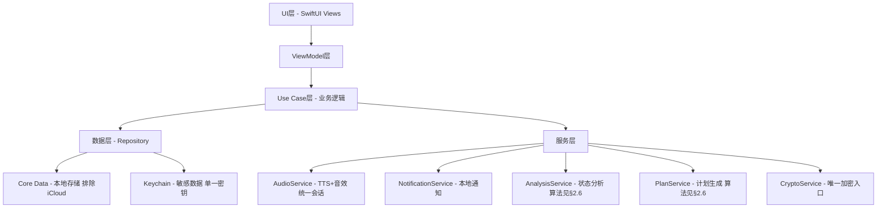
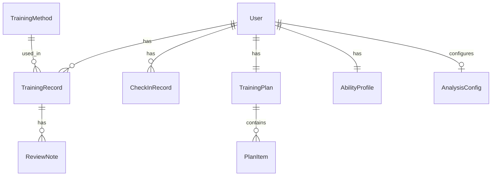
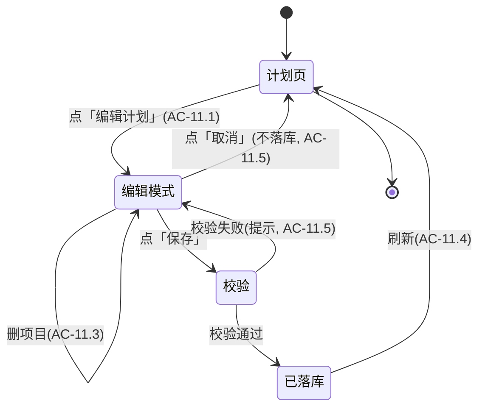

# 设计文档（v2.0 正式版）

> **文档状态**：v2.0（对齐需求文档 v2.0，全量 AC 覆盖）＋ v2.1 训练计划增强设计（需求 10/11/12，决策已冻结）
> **最后更新**：2026-07-12
> **说明**：第二轮重写的设计基线——①落地需求 3/6 的算法规格（消除黑盒）；②更正安全设计与代码真实缺陷（BUG-CT-01/03/04/06）的一致性；③补充需求 8/9、合规、无障碍、iCloud 排除的设计；④数据模型补强校验与状态字段；⑤建立 AC 追溯映射实现"需求→设计→缺陷"闭环；⑥v2.1 新增 §5 训练计划增强设计（需求 10/11/12），沉淀三种计划相关需求的完整交互流/数据契约/服务与视图模型契约，并固化 Q1–Q6 决策记录（原 `design-需求10/11/12` 已归档至 `docs/archive/plan-v2.1/`）。

### 修订历史

| 版本 | 日期 | 修订内容 |
|------|------|----------|
| v1.0 | 2026-07（第一轮） | 初始设计，覆盖需求 1–7，存在算法黑盒、安全描述与实际代码矛盾、需求 8/9/合规/无障碍缺失 |
| v2.0 | 2026-07-11 | **本轮重写**：①新增 §2.6 算法规格（映射表+加权模型）；②更正 §2.4 安全设计（单一加密入口、单一后台锁注册、后台模糊而非截屏模糊、NSFileProtectionComplete 正确写法）；③新增 §2.1.4 数据管理页、§2.1.5 合规页、§2.7 无障碍设计；④数据模型补 selfRating 校验、CheckInStatus 枚举、AnalysisConfig、部分记录分支；⑤补充 iCloud 排除；⑥复盘提升为独立 Tab；⑦建立 §4 AC 追溯映射表 |
| v2.1 | 2026-07-12 | **训练计划增强设计（需求 10/11/12，决策已冻结）**：①数据层——`PlanModels.swift` 新增 `UserPlanTemplate`（`days:[UserPlanTemplateDay]`，Q3 支持一日多方法；保留 `methodIds`/`trainingDayOffsets` 计算属性 + `description`）+ `PlanDraft`（按日 `dayDrafts`）；`*.xcdatamodeld` 新增 `CDUserPlanTemplate`（`daysData` Binary JSON，整库排除 iCloud）；`CDUserPlanTemplate+CoreDataClass.swift`；`PlanRepository` 仅新增 `saveUserTemplate`/`fetchUserTemplates`/`deleteUserTemplate`（Q6：不新增单条增删改）；`PlanService` 新增 `buildCustomPlan(dayDrafts:baseTemplate:goal:)`/`draftFromTemplate`/`draftFromUserTemplate`/`allTemplatesForSelection`/`saveUserTemplate`/`loadUserTemplates`。②**完整设计沉淀于 §5**（交互流/数据契约/服务与视图模型契约 + Q1–Q6 决策记录），原 `design-需求10/11/12` 已归档至 `docs/archive/plan-v2.1/` |
| v2.1.1 | 2026-07-12 | 文档整理：将 `docs/ai-workflow/plan-v2.1/` 下的 v2.1 设计草案（需求 10/11/12 设计规格 + 01~04 分工 Prompt）**完整合并**进本文件 §5（含 AC 映射/流程图/数据模型/契约/决策记录，自包含），原文件归档至 `docs/archive/plan-v2.1/`（含 MANIFEST，作快照）；`open-questions.md`/`BUG-TASK-ASSIGNMENT.md` 保留原位并标注已完成 |

---

## 1. 技术架构

### 1.1 技术选型

- **前端技术栈**：SwiftUI + UIKit（混合开发）
- **开发语言**：Swift 5.9+
- **最低支持版本**：iOS 16.0
- **数据存储**：Core Data（本地持久化，**排除 iCloud 备份**）+ Keychain（敏感数据）
- **图表库**：SwiftCharts（原生图表框架）
- **音频引擎**：AVFoundation
  - 语音引导：**系统 TTS（`AVSpeechSynthesizer`）实时合成中文（zh-CN）**
  - 关键节点辅以**预录短音效**（Resources/Sounds）
  - 音频会话**统一在 `AudioService` 配置**（`.playback` + `.spokenAudio` + `.duckOthers` + `.allowBluetooth` + `.mixWithOthers`），禁止在 `AppDelegate` 或 `SecurityService` 重复配置（呼应 BUG-CT-06）
- **通知服务**：UserNotifications（本地通知，非推送）
- **认证服务**：LocalAuthentication（Face ID/Touch ID）
- **加密**：CryptoKit AES-256-GCM，**统一由 `CryptoService` 单一密钥入口**（消除 BUG-CT-03 双密钥风险）
- **架构模式**：MVVM + Clean Architecture

### 1.2 系统架构



### 1.3 核心模块

| 模块 | 职责 |
|------|------|
| TrainingModule | 训练方法管理、训练内容展示、收藏 |
| CoachModule | 实时陪练、TTS 语音引导、计时与呼吸动画、部分记录 |
| PlanModule | 计划制定、评估问卷、动态调整 |
| CheckInModule | 每日打卡（有效/补签/部分态）、连续天数、成就 |
| ReviewModule | 训练复盘、数据趋势、报告生成 |
| AnalysisModule | 状态分析（§2.6 加权模型）、能力评分、改善建议 |
| SecurityModule | 隐私保护、单一加密、生物识别、后台模糊 |
| DataModule | 数据导出/导入/彻底删除（**新增，需求 8**） |
| SettingsModule | 设置与无障碍偏好（**新增，需求 9**） |

---

## 2. 详细设计

### 2.1 前端设计

#### 2.1.1 页面结构与导航

```
App
├── 首次启动引导流（AC-9.4）                  ← 新增，仅新用户
│   ├── Step 1: 评估问卷（需求 3，AC-3.1）
│   ├── Step 2: 隐私说明 + 免责声明（AC-C.1）
│   └── Step 3: 进入主页
│
├── TabView（主标签栏，6 Tab）
│   ├── 首页（今日概览 + 快捷入口 + 打卡）
│   ├── 训练（训练方法列表 + 详情 + 收藏）
│   ├── 陪练（实时训练界面）
│   ├── 计划（个人计划管理）
│   ├── 复盘（历史记录 + 趋势 + 报告）        ← 独立一级入口
│   └── 我的
│       ├── 能力雷达图 + 数据统计
│       ├── 设置（AC-9.1~9.3）
│       ├── 数据管理（导出/导入/删除）         ← 需求 8
│       └── 合规页                               ← §6
│           ├── 免责声明（AC-C.1）
│           └── 隐私政策（AC-C.3）
```

> 变更点：①复盘(Review) 提升为独立 Tab（原隐藏于「我的」可达性弱）；②数据管理、合规页归入「我的」；③新增首次启动引导流（评估→隐私→主页），`User.assessmentCompleted` 控制是否展示。

#### 2.1.2 核心页面设计

**首页**：今日训练任务卡片（含打卡状态）、连续打卡天数、当前能力评分概览、快捷开始训练按钮。

**训练方法页**：分类列表（类型+难度筛选）、详情页（原理/步骤图解/注意事项/**禁忌人群 AC-C.5**/**来源标注 AC-C.2**）、收藏入口（≤2 次点击）。

**陪练页**：训练模式选择（基础/渐进/间歇）、倒计时准备（默认 5s 可配 3–10s）、环形计时器（≥60fps）、呼吸引导动画、TTS 语音状态指示、暂停/继续、**来电中断暂停提示（AC-2.9）**。

**计划页**：当前计划概览、日历视图、进度、**评估问卷入口**、手动调整、动态调整记录。

**复盘页**：历史记录列表、趋势图表（SwiftCharts）、周/月报告（手动+每周一/每月1日提示）、文字备注。

**我的页**：
- 能力雷达图 + 训练数据统计
- 设置（通知/生物识别/字号/呼吸默认开关，AC-9.1）
- **数据管理（导出/导入/彻底删除，AC-8.x）**
- **合规页入口（免责声明 AC-C.1 / 隐私政策 AC-C.3）**

#### 2.1.3 状态管理

`@StateObject` / `@EnvironmentObject` 管理状态；ViewModel 方法标记 `@MainActor`（替代手动 `DispatchQueue.main.async`，呼应 S07）：
- `TrainingViewModel`、`CoachViewModel`、`PlanViewModel`、`CheckInViewModel`、`AnalysisViewModel`、`SettingsViewModel`、`DataViewModel`

#### 2.1.4 数据管理页设计（需求 8，AC-8.1~8.5）

```
数据管理页（入口：我的 → 数据管理）
├── 导出数据
│   ├── 加密导出 Core Data + Keychain 为 .ctbackup 文件
│   ├── 二次加密（生物识别/密码确认）
│   └── 通过系统分享 Sheet（文件 App / 隔空投送）
├── 导入数据
│   ├── 选择 .ctbackup 文件
│   ├── 校验文件完整性（HMAC）
│   ├── 解密 → 覆盖现有数据（导入前弹二次确认）
│   └── 导入后刷新 viewContext
└── 彻底删除
    ├── NSBatchDeleteRequest 清空 Core Data
    ├── viewContext.reset() 刷新缓存（呼应 BUG-CT-02）
    ├── 清理 Keychain 凭证
    └── 二次确认弹窗：「此操作不可恢复」（AC-8.4）
```

> 实现载体：`DataModule` → `DataViewModel` + `DataService`，导出格式统一为 `.ctbackup`。

#### 2.1.5 合规页设计（§6，AC-C.1~C.5）

**免责声明页**（AC-C.1）：
- 明确声明"本 App 提供训练参考，不替代专业医疗诊断与治疗"
- 列出禁忌情况（急性炎症期、术后恢复期、严重心血管病史者须先咨询医生，呼应 AC-C.5）
- 底部「已知晓并同意」按钮，点击后记录 `User.disclaimerAccepted`

**隐私政策页**（AC-C.3）：
- 说明数据收集范围（仅本地）
- 说明加密方式（AES-256-GCM + Keychain）
- 说明不对外上传、不含第三方 SDK
- App Store 审核合规声明

**训练方法来源标注**（AC-C.2）：
- 每个 `TrainingMethod` 的详情页底部展示 `source` 字段（如"基于公开医学文献"或具体参考文献）

> 合规页为静态内容页（`ScrollView + Text`），不含网络依赖。

### 2.2 数据模型设计

#### 2.2.1 核心实体（ER）



#### 2.2.2 数据模型定义（含校验与状态）

**User**：id(UUID)、createdAt(Date)、assessmentCompleted(Bool)、settings(UserData)

**TrainingMethod**：id、name、category、difficulty、description、steps、duration、isFavorite、**source(来源标注 AC-C.2)**、**contraindication(禁忌人群 AC-C.5)**

**TrainingRecord**：id、methodId、date、duration、completionRate(Double)、
- `selfRating: Int` —— **init 内强制 1–5（`clamped`/precondition，呼应 BUG-CT-05 / AC-5.7）**
- `isPartial: Bool` —— 强制退出生成的部分记录（AC-2.10），`completed=false` 不计入有效打卡
- notes

**TrainingPlan**：id、startDate、endDate、items[PlanItem]、progress、**adjustmentLog[Adjustment]（动态调整记录 AC-3.6）**

**CheckInRecord**：id、date、checkInTime、trainingRecordId?、
- `status: CheckInStatus` 枚举 = `.valid`(有效) / `.makeup`(补签) / `.partial`(部分，不计入有效)（AC-4 定义）

**AbilityProfile**：id、overallScore(Int 0–100)、endurance/control/recovery/breathCoordination/muscleStrength(Double 0–100)、level(AbilityLevel)、lastUpdated、**dataSufficient(Bool，数据不足时显示"暂无足够数据" AC-6.7）**

**AnalysisConfig（新增）**：集中存放可配置常量，便于校准与单元测试。字段清单：

| 配置项 | 键名 | 默认值 | 对应 AC |
|--------|------|--------|---------|
| 五维权重 | `enduranceWeight` 等 | 0.25 / 0.25 / 0.20 / 0.15 / 0.15 | AC-6.1 |
| 目标周时长 | `targetWeeklyMinutes` | 60 min | AC-6.1 |
| 目标单次时长 | `targetSessionMinutes` | 20 min | AC-6.1 |
| 等级阈值 | `levelThresholds` | [0,21,41,61,81] → 入门/初级/中级/高级/专家 | AC-6.3 |
| 数据不足阈值 | `minTrainingCount` | 3 次（30 天内） | AC-6.7 |
| 滚动窗口 | `analysisWindowDays` | 30 天 | AC-6.1 |
| 每月补签上限 | `maxMakeupPerMonth` | 3 次 | AC-4.6 |
| 倒计时准备默认 | `defaultCountdownSeconds` | 5s（可配 3–10s） | AC-2.1 |
| 重算时间 | `recalculationTime` | 每周一 00:00 本地时间 | AC-6.7 |

> 所有常量通过 `AnalysisConfig` 集中管理，禁止硬编码散落各处。单元测试通过注入不同 `AnalysisConfig` 验证边界行为。

### 2.3 业务逻辑设计

#### 2.3.1 训练陪练流程（含部分记录）

```
选择训练方法 → 选择模式 → 倒计时准备 →
训练中（TTS + 计时 + 呼吸动画，支持暂停/继续） →
├─ 正常结束 → 自动记录(completed=true) → 弹出复盘问卷
└─ 强制退出/来电中断 → 生成部分记录(isPartial=true, completed=false) → 不弹复盘，不计入有效打卡（AC-2.10）
```

#### 2.3.2 计划生成算法（见 §2.6.1 映射表）

1. 评估问卷 → 初始能力映射
2. 能力等级匹配训练模板
3. 按目标调整强度/频率
4. 生成周期计划（周/月/季）
5. 按训练完成数据动态调整，写入 adjustmentLog

#### 2.3.3 状态分析算法（见 §2.6.2 加权模型）

1. 收集近 30 天训练数据
2. 按维度公式算 D_i（0–100）
3. 综合 S = Σ(w_i × D_i)
4. 映射能力等级
5. 识别最低维为薄弱环节
6. 生成改善建议（最低维驱动，关联需求 1/3）

### 2.4 安全设计（更正版）

- **数据加密**：Core Data 启用 `NSFileProtectionComplete`（**单一正确写法 `.complete`，避免 `true as NSNumber` 无效值，呼应 BUG-CT-04**）；敏感字段经 **`CryptoService` 唯一入口** AES-256-GCM 加密（**禁止 `SecurityService` 内嵌加解密，消除 BUG-CT-03 双密钥**）。
- **认证机制**：`LocalAuthentication` 实现 Face ID/Touch ID；应用内密码锁可选。
- **后台模糊**：**应用进入后台（`scenePhase == .background`）时显示模糊遮罩**（`BlurredOverlayView`）。**注意：iOS 截图由系统捕获，无法在截屏瞬间模糊，原"截屏模糊"描述不准确，改为后台模糊**（呼应既有实现）。
- **后台锁注册唯一性**：`didEnterBackground` → `lockApp()` 观察者**仅在一处注册**（推荐 `AppDelegate`），**禁止 `SecurityService.configureProtection()` 在 `onAppear` 重复注册，消除 BUG-CT-01 双重触发**。
- **Keychain 存储**：`kSecAttrAccessibleWhenUnlockedThisDeviceOnly`。
- **iCloud 排除**：Core Data 存储目录添加 `skipBackup` 属性（AC-7.5）。
- **彻底删除**：`deleteAllUserData()` 执行 `NSBatchDeleteRequest` 后须 `viewContext.reset()` 并清理 Keychain（呼应 BUG-CT-02 / AC-8.3）。

### 2.5 目录结构设计

```
ControlTraining/
├── App/ (ControlTrainingApp.swift, AppDelegate.swift)
├── Modules/ (Home/Training/Coach/Plan/CheckIn/Review/Analysis/Security/Data/Settings)
│   └── 各模块含 Views/ ViewModels/ [Services|Models]
├── Core/
│   ├── Data/ (Models/ Repositories/ CoreDataStack.swift / AnalysisConfig.swift)
│   ├── Services/ (AudioService / NotificationService / SecurityService / CryptoService)
│   └── Utilities/ (Extensions/ Helpers/)
└── Resources/ (Assets.xcassets / Sounds/ / Localizable.strings)
```

### 2.6 算法规格（核心，消除黑盒）

#### 2.6.1 计划生成映射表（需求 3，AC-3.2）

| 输入维度 | 取值 | 映射结果 |
|----------|------|----------|
| 能力自评 | 1–2 | 频率 3 次/周，单次 10min，初级为主 |
| 能力自评 | 3–4 | 频率 4 次/周，单次 15min，初+中级 |
| 能力自评 | 5 | 频率 5 次/周，单次 20min，中+高级 |
| 训练经验 | 无 | 首周仅凯格尔+呼吸 |
| 训练经验 | 规律 | 可引入停-动/挤压 |
| 目标 | 延时 | 停-动/挤压权重提高 |
| 目标 | 综合 | 五类均衡 |

> 映射逻辑集中于 `PlanService`，常量集中配置，可校准。

#### 2.6.2 状态分析加权模型（需求 6，AC-6.1）

```
S = Σ(w_i × D_i)，Σw_i = 1
```

| 维度 D_i | 权重 | 数据来源（近 30 天） | 计算（草案） |
|----------|------|----------------------|--------------|
| 持久力 endurance | 0.25 | 累计时长、单次最长 | `min(100, 累计/目标周时长×60 + 单次最长/目标单次×40)` |
| 控制力 control | 0.25 | 计划完成率、自评均值 | `完成率×50 + 自评(1–5→0–100)×50` |
| 恢复力 recovery | 0.20 | 连续打卡天数、中断次数 | `min(100, 连续天数/14×100) × (1 - 中断惩罚)` |
| 呼吸配合 breath | 0.15 | 启用呼吸引导占比 | `呼吸引导次数 / 总次数 × 100` |
| 肌肉力量 strength | 0.15 | 凯格尔/骨盆底频率与时长 | 同持久力思路，仅统计该类 |

**等级阈值**：0–20 入门 / 21–40 初级 / 41–60 中级 / 61–80 高级 / 81–100 专家（AC-6.3）。
**重算**：每周一 00:00 本地；数据不足（<3 次训练）显示"暂无足够数据"（AC-6.7）。
**测试**：算法须有单元测试（给定输入断言输出，AC-6.8）。

### 2.7 无障碍设计（需求 9 / §7.2，新增）

- **AC-NF.4** 支持 Dynamic Type，最大字号核心流程不溢出；字号偏好在 Settings 实时生效。
- **AC-NF.5** 关键可点击区域 ≥ 44×44 pt。
- **AC-NF.6** 主流程 VoiceOver 可用，图标按钮带无障碍标签。
- 默认字号档位：标准 / 大 / 超大（AC-9.1）。

---

## 3. 质量保障

### 3.1 测试策略

- **单元测试**：计划生成映射（§2.6.1）、状态分析加权模型（§2.6.2，**须断言数值**）、模型校验（selfRating 越界）、加密往返、删除后缓存刷新。
- **UI 测试**：训练流程、打卡流程（**须以测试文件存在与通过为准，避免任务过度声明**）。
- **集成测试**：Repository→Service→ViewModel 链路（弥补 v1.0 缺失）。
- **性能测试**：音频播放、数据查询（1000 条 ≤ 200ms）。

### 3.2 性能优化

- TTS 语音短语预合成缓存；音效资源预加载。
- Core Data 懒加载 + 分页；图表数据缓存，避免重复计算。

### 3.3 隐私与合规

- 全部本地存储，不上传（AC-7）。
- 名称/图标不暗示敏感内容（AC-C.4）。
- 提供免责声明页与隐私政策页（AC-C.1 / AC-C.3，设计见 §2.1.5）。
- 训练方法标注来源与禁忌人群（AC-C.2 / AC-C.5，设计见 §2.1.5）。

---

## 4. AC 追溯映射表（需求→设计→缺陷闭环）

> 本节建立需求验收标准与设计章节、已知缺陷的映射，实现"需求→设计→代码缺陷"可追溯。

### 4.1 需求覆盖映射

| 需求 | AC 编号 | 设计章节 | 关键设计元素 |
|------|---------|----------|-------------|
| 需求 1 - 训练方法 | AC-1.1~1.6 | §2.1.2 训练方法页、§2.2.2 TrainingMethod | 分类列表、难度筛选、收藏、来源标注、禁忌人群、矢量图解 |
| 需求 2 - 陪练 | AC-2.1~2.10 | §2.1.2 陪练页、§2.3.1 流程、§1.1 AudioService | TTS 语音、计时器、呼吸动画、暂停继续、部分记录、来电中断 |
| 需求 3 - 计划 | AC-3.1~3.8 | §2.1.2 计划页、§2.3.2、§2.6.1 映射表 | 评估问卷、映射规则、周期计划、动态调整 |
| 需求 4 - 打卡 | AC-4.1~4.8 | §2.1.2 首页、§2.2.2 CheckInRecord | 有效打卡、补签限次(3次/月)、打卡日历热力图 |
| 需求 5 - 复盘 | AC-5.1~5.7 | §2.1.2 复盘页、§2.2.2 TrainingRecord | 复盘问卷、周/月报告、selfRating 1–5 校验 |
| 需求 6 - 状态分析 | AC-6.1~6.8 | §2.3.3、§2.6.2 加权模型、§2.2.2 AbilityProfile | 五维加权、等级划分、薄弱识别、单元测试 |
| 需求 7 - 隐私 | AC-7.1~7.6 | §2.4 安全设计、§1.1 加密/Keychain | 单一加密入口、后台模糊、后台锁唯一注册、iCloud 排除 |
| 需求 8 - 数据管理 | AC-8.1~8.5 | §2.1.4 数据管理页、§2.4 彻底删除 | 加密导出、导入校验、彻底删除+二次确认 |
| 需求 9 - 设置 | AC-9.1~9.4 | §2.1.2 我的页、§2.7 无障碍、§2.1.1 引导流 | 字号/通知/生物识别/呼吸开关、Dynamic Type、VoiceOver、44pt |
| §6 合规 | AC-C.1~C.5 | §2.1.5 合规页、§2.2.2 TrainingMethod | 免责声明、隐私政策、来源标注、禁忌人群、审核名称 |

### 4.2 缺陷→设计约束追溯

| 缺陷编号 | 根因 | 设计约束（本版已固化） | 对应章节 |
|----------|------|----------------------|----------|
| BUG-CT-01 | 后台锁双重注册 | 观察者仅在一处注册（AppDelegate） | §2.4 |
| BUG-CT-02 | 删除后缓存未刷新 | `deleteAllUserData` 须 `viewContext.reset()` | §2.4 |
| BUG-CT-03 | 双密钥 | 统一 `CryptoService` 单一入口 | §1.1、§2.4 |
| BUG-CT-04 | 文件保护无效值 | `NSFileProtectionComplete` 单一正确写法 `.complete` | §2.4 |
| BUG-CT-05 | selfRating 越界 | init 内强制 `clamped`/precondition 1–5 | §2.2.2 |
| BUG-CT-06 | 音频会话重复配置 | 统一在 `AudioService` 配置 | §1.1 |
| BUG-CT-07 | Keychain API 调用错误 | 统一使用 `KeychainService.shared` | §1.1 |
| S01 | 无国际化 | 当前仅中文，保留 `Localizable.strings` 占位 | §2.5 |
| S04 | UserDefaults 键名散落 | 集中为枚举常量 | §2.2.2 Settings |
| S07 | 手动 DispatchQueue.main | ViewModel 方法标记 `@MainActor` | §2.1.3 |

> 缺陷 BUG-CT-01~07 已全部关闭（见 `docs/reviews/archive/v3.0-代码审查报告.md`，该报告已失效被 v5.1 推翻）。本设计将根因约束固化，防止第二轮重开回归。

---

---

## 5. v2.1 训练计划增强设计（需求 10 / 11 / 12）

> 迭代：v2.1 ｜ 关联 AC：AC-10.1~10.7、AC-11.1~11.7、AC-12.1~12.6
> 设计冻结依据：`docs/ai-workflow/plan-v2.1/open-questions.md`（Q1–Q6 已全部确认，设计冻结）
> 本节为需求 10/11/12 的**完整设计合并**（含 AC 映射、流程图、数据模型、服务/视图模型契约与决策记录），已自包含，源自 `design-需求10-自定义计划.md` / `design-需求11-逐条编辑.md` / `design-需求12-直达陪练.md`（已归档至 `docs/archive/plan-v2.1/`，作为历史快照保留）。

### 5.1 需求 10 — 自定义训练计划（AC-10.1~10.7）

> 必读：`requirements.md` §需求10、`PlanModels.swift`、`PlanService.swift`、`PlanViewModel.swift`、`PlanRepository.swift`、`PlanView.swift`（TemplateSelectionView）
> 决策状态：open-questions Q1–Q6 已全部确认，本文据此固化。**Q3 关键变更**：自定义阶段支持「同一天多方法」，数据模型由扁平 `selectedMethodIds/trainingDayOffsets` 改为按日分组的 `dayDrafts` / `days`。

**AC 映射一览**

| AC | 设计落点 |
|----|----------|
| AC-10.1 | PlanView 顶部 Menu 新增「自定义计划」入口（≤2 次点击）|
| AC-10.2 | 编辑器以「选模板再改」初始化（模板→草稿预填，按日分组）|
| AC-10.3 | 编辑器以「空白自建」初始化（先选目标/难度，再选方法+排期）|
| AC-10.4 | 编辑器仅暴露「方法 / 每周训练天数 / 具体训练日期」，不暴露时长/强度/周期 |
| AC-10.5 | `UserPlanTemplate` 持久化 + 模板库展示预设与「我的」+ 复用/删除 |
| AC-10.6 | 生成计划写入活跃计划（覆盖前二次确认）+ `updateProgress()` |
| AC-10.7 | 编辑器遵循 Dynamic Type / ≥44pt / VoiceOver |

**交互流程图（两种起点共用编辑器）**

```mermaid
flowchart TD
    A[计划页 Menu: 自定义计划] --> B{选择起点}
    B -->|选模板再改| C[模板列表 planTemplates / 我的模板]
    C -->|选定| D[编辑器: 预填 dayDrafts<br/>draftFromTemplate / draftFromUserTemplate]
    B -->|空白自建| E[选目标/难度 goal + difficulty]
    E --> F[编辑器: 空白 dayDrafts=[]]
    D --> G[编辑器 PlanBuilderView]
    F --> G
    G -->|调整每周训练天数/具体日期| G
    G -->|每日设置方法 可多选 Q3| G
    G -->|保存为我的模板| H[命名弹窗 name]
    H -->|确认| I[UserPlanTemplate 持久化 days]
    I --> G
    G -->|生成计划| J{已有活跃计划?}
    J -->|是| K[二次确认: 将替换当前计划]
    K -->|确认| L[写入活跃计划 + updateProgress]
    J -->|否| L
    K -->|取消| G
    L --> M[计划页刷新]
    G -->|取消| M
```

- **共用编辑器** `PlanBuilderView`，内部状态为内存草稿 `PlanDraft`（见下）。初始数据源不同（模板预填 vs 全空），后续编辑逻辑完全一致（AC-10.2/10.3/10.4）。
- **仅暴露三类控件**：方法（按日多选 sheet）、每周训练天数（Stepper）、具体训练日期（星期多选）。**不出现**时长/强度/周期入口（AC-10.4）。
- **Q3 每日多方法**：每个训练日通过「设置方法」sheet 可勾选多个方法；生成计划时该日每条 (日,方法) 对应一条 `PlanItem`。

**草稿与数据模型**

*编辑器内存草稿（不落库）*

```swift
struct DayDraft: Identifiable, Hashable {
    let id: UUID
    var dayOffset: Int        // 0...6，相对 plan.startDate 的星期偏移
    var methodIds: [UUID]      // 该日选择的训练方法（≥1，支持多方法，Q3）
}

struct PlanDraft {
    var sourceTemplateId: UUID? = nil
    var name: String = ""
    var goal: TrainingGoal = .endurance
    var difficulty: DifficultyLevel = .beginner
    var dayDrafts: [DayDraft] = []      // 取代原 selectedMethodIds + trainingDayOffsets

    var allMethodIds: [UUID] { /* 去重保序，全部已选方法，供模板保存/展示 */ }
    var trainingDayOffsets: [Int] { dayDrafts.map { $0.dayOffset }.sorted() } // 兼容既有字段命名
}
```

*新增模型：`UserPlanTemplate`（我的模板，可持久化）*

```swift
struct UserPlanTemplateDay: Codable, Identifiable, Hashable {
    let id: UUID
    var dayOffset: Int
    var methodIds: [UUID]      // 该日方法（≥1）
}

struct UserPlanTemplate: Identifiable, Codable {
    let id: UUID
    var name: String
    let difficulty: DifficultyLevel
    let frequency: Int              // 每周训练天数（= days.count）
    let goal: TrainingGoal
    let icon: String
    let days: [UserPlanTemplateDay]  // 每日方法（Q3 支持一日多方法）
    var description: String?        // Q5 确认：可选
    let createdAt: Date
    var updatedAt: Date

    var methodIds: [UUID] { /* 全部方法去重，兼容既有字段命名 */ }
    var trainingDayOffsets: [Int] { days.map { $0.dayOffset }.sorted() }
}
```

- 仍满足需求 10「字段至少含 name/difficulty/frequency/goal/icon/methodIds/trainingDayOffsets」：`methodIds`/`trainingDayOffsets` 作为计算属性保留，物理存储为 `days`（Q3）。
- `frequency = days.count`（每周训练天数，冗余保存便于模板库展示）。

*Core Data 实体 `CDUserPlanTemplate`*

| 属性 | 类型 | 说明 |
|------|------|------|
| `id` | UUID | 默认 UUID |
| `name` | String | 非空 |
| `difficulty` | String (raw) | `DifficultyLevel` rawValue |
| `frequency` | Integer 16 | = days.count |
| `goal` | String (raw) | `TrainingGoal` rawValue |
| `icon` | String | 默认 `"star.fill"` |
| `daysData` | Binary | JSON 编码 `[UserPlanTemplateDay]`（承载 Q3 每日多方法）|
| `desc` | String? | 可选（Q5）|
| `createdAt`/`updatedAt` | Date | now |

- **iCloud 排除（AC-7.5/AC-NF.7）**：与计划数据同栈，存储文件已在 `DataController` 配置 `excludeFromBackup`。
- 编解码：`CDUserPlanTemplate+CoreDataClass.swift` 以 `JSONEncoder/Decoder` 在 `daysData` 与 `[UserPlanTemplateDay]` 间转换。
- **迁移提示**：v2.1 开发期以 `daysData` 替换旧 `methodIds`/`trainingDayOffsets`（String 列）。该实体为全新功能、无既有用户数据，轻量迁移（加列 + 删列）由 Core Data 自动推断完成。

*与既有模型兼容性*

| 模型 | 关系 |
|------|------|
| `PlanTemplate`（预设）| in-code 结构体；`draftFromTemplate` 将其生成的 `TrainingPlan` 按日分组为 `dayDrafts`，**保留预设中已有的「一日多方法」**（如标准+ 每日 2 方法）。模板库 UI 将预设与「我的」以两段展示。 |
| `TrainingPlan`/`PlanItem` | `buildCustomPlan` 产物最终转为 `TrainingPlan`，**不改变**既有 `PlanItem` 字段；每个 (日,方法) 一条 `PlanItem`。 |
| `TrainingMethod` | `methodIds` 经 `TrainingContentData.method(id:)` 解析取 `name/defaultDuration` 构造 `PlanItem`。 |

**`PlanService` 扩展点**

```swift
extension PlanService {
    /// 由预设模板生成编辑器草稿（按日分组，AC-10.2）
    func draftFromTemplate(_ template: PlanTemplate) -> PlanDraft
    /// 由「我的模板」还原草稿（AC-10.5 复用）
    func draftFromUserTemplate(_ ut: UserPlanTemplate) -> PlanDraft

    /// 由草稿生成自定义计划（Q3 每日可多方法，AC-10.2/10.3/10.6）
    func buildCustomPlan(dayDrafts: [DayDraft],
                         baseTemplate: PlanTemplate? = nil,
                         goal: TrainingGoal? = nil) -> TrainingPlan
}
```

- `buildCustomPlan`：固定 `periodDays = 7`（`startDate` 今日起，`endDate = +7`）；对每个 `day ∈ dayDrafts`，为 `day.methodIds` 中每个方法生成一条 `PlanItem(date: methodId: methodName: duration: method.defaultDuration)`；`updateProgress()`。
- 由模板初始化：`draftFromTemplate(_:)` 调 `generatePlanFromTemplate` 得 `TrainingPlan`，**按 `date` 相对 `startDate` 的 dayOffset 分组**各 `item.methodId`，保留「一日多方法」；由空白初始化：`dayDrafts=[]`、`goal/difficulty` 由用户在起点页选择（AC-10.3）。
- 不修改 `generatePlan`/`generatePlanFromTemplate`/`adjustPlan` 既有逻辑（AC-10.6 兼容）。

**`PlanViewModel` / `PlanRepository` 契约**

```swift
// PlanViewModel
func openCustomPlan(from template: PlanTemplate? = nil)
func loadUserTemplates()
func saveCurrentDraftAsTemplate(name: String)   // 以 dayDrafts 构造 UserPlanTemplate
func deleteUserTemplate(_ id: UUID)
func generatePlanFromDraft()                     // 校验 dayDrafts 非空且至少一天有方法

// PlanRepository（复用，无需新增单条方法）
func saveUserTemplate(_ template: UserPlanTemplate)
func fetchUserTemplates() -> [UserPlanTemplate]
func deleteUserTemplate(_ id: UUID)
```

- `generatePlanFromDraft()`：内部 `commitCustomPlan` 调 `buildCustomPlan(dayDrafts:goal:)` → 覆盖写（`deletePlan` 旧活跃计划）→ `saveTrainingPlan` → `loadPlan()`。

**无障碍与范围边界（AC-10.7）**
- 可点元素 ≥44×44pt；每日方法 sheet 内方法行按钮满足。
- 关键控件加 `.accessibilityLabel`（如「周一 已选 凯格尔运动、呼吸训练」）。
- 不引入新三方库/架构；沿用 MVVM + Repository + Core Data。
- **Q4 确认：v2.1 不做模板就地编辑**；「编辑模板」=「选我的模板再改」后另存为新模板（旧的可删）。
- **Q5 确认：模板含 `description` 字段**。

### 5.2 需求 11 — 当前计划逐条编辑（AC-11.1~11.7）

> 必读：`requirements.md` §需求11、`PlanModels.swift`（`PlanItem`/`TrainingPlan`）、`PlanRepository.swift`、`PlanViewModel.swift`、`TrainingContentData.swift`
> 决策状态：open-questions Q6 已确认 → **仅实现全量保存**（`updatePlanItems`），不提供单条粒度 Repository 方法。

**AC 映射一览**

| AC | 设计落点 |
|----|----------|
| AC-11.1 | PlanView 顶部 Menu 新增「编辑计划」入口（≤2 次点击进入编辑模式）|
| AC-11.2 | 逐条改：替换方法 / 改单次时长 / 改所在日期 |
| AC-11.3 | 增删某天项目（新增从方法池选；删除即移除）|
| AC-11.4 | 保存写入 Core Data（后台上下文+合并）+ 刷新进度/日历/今日 + `updateProgress()` |
| AC-11.5 | 取消不落库；保存校验：时长>0、日期∈[startDate,endDate] |
| AC-11.6 | 复用 `PlanRepository`/`PlanItem`；保留「智能调整」入口 |
| AC-11.7 | 编辑界面 Dynamic Type / ≥44pt / VoiceOver |

**编辑草稿状态机**



- **草稿 = 当前 `TrainingPlan` 的内存可变副本**（`PlanEditDraft` 持有 `items` 可变数组）。进入编辑即深拷贝 `currentPlan`，全程不写库；「取消」直接丢弃副本（AC-11.5）。
- **保留「智能调整」**：编辑模式与「智能调整」入口并存，二者均最终落到 `updatePlanItems`；不改动 `adjustPlanIfNeeded`（AC-11.6）。

**数据模型（沿用，不新增实体）**
- **复用 `PlanItem`**：`id / date / methodId / methodName / duration / isCompleted / completedAt`。编辑仅修改 `methodId/methodName/duration/date` 四个可变维度；`isCompleted/completedAt` 保持（已完成的项编辑后可保留完成态）。
- **复用 `TrainingPlan`**：`items` 替换为草稿 `items` 后整体保存；`updateProgress()` 依据 `items` 重算（AC-11.4）。
- **方法来源**：`TrainingContentData.allTrainingMethods()` 提供方法池；替换/新增时取 `method.id` 与 `method.name`。

*编辑态载体（轻量结构体，不落库）*

```swift
struct PlanEditDraft {
    let planId: UUID
    let startDate: Date
    let endDate: Date
    var items: [PlanItem]          // 可变副本
}
```

**`PlanRepository` 接口契约（数据层）**

主保存路径复用既有 `updatePlanItems(planId:items:)`（全量替换 items 并重算进度）。**Q6 已确认：v2.1 仅实现全量保存，不提供单条粒度方法**；编辑态的增/删/改均在内存 `PlanEditDraft.items` 上完成，保存时一次性整体落库。

```swift
// 既有（直接复用，勿改）
func updatePlanItems(planId: UUID, items: [PlanItem])      // 全量替换 + updateProgress
```

- 写操作沿用 `dataController.performBackgroundTask` + 主上下文合并策略（呼应 AC-NF.8），与 `saveTrainingPlan` 既有一致。
- 进度一致性：保存后 `updatePlanItems` 内部已调用 `updateProgress()`（重算 `CDTrainingPlan.progress`）。

**`PlanViewModel` 契约（前端驱动）**

```swift
@Published var showPlanEditor: Bool = false
@Published var editingDraft: PlanEditDraft? = nil

/// 进入编辑模式：深拷贝当前计划为草稿（AC-11.1）
func beginPlanEditing()
/// 替换某项的训练方法（AC-11.2）
func editItemMethod(_ itemId: UUID, method: TrainingMethod)
/// 修改某项单次时长（单位秒；保存校验 >0，AC-11.2）
func editItemDuration(_ itemId: UUID, duration: TimeInterval)
/// 修改某项所在日期（校验落在 [startDate,endDate]，AC-11.2）
func editItemDate(_ itemId: UUID, date: Date)
/// 新增项目（默认未完成；duration 取自所选方法 defaultDuration，AC-11.3）
func addItem(method: TrainingMethod, date: Date)
/// 删除项目（AC-11.3）
func removeItem(_ itemId: UUID)

/// 保存：先校验再落库（AC-11.4/11.5）
func savePlanEdits() -> [PlanEditValidationError]
/// 取消：丢弃草稿（AC-11.5）
func cancelPlanEdits()
```

> 注：`editItemMethod`/`editItemDuration`/`editItemDate`/`addItem`/`removeItem` 均只修改内存 `editingDraft.items`；真正落库仅发生在 `savePlanEdits()` → `updatePlanItems`。

**保存校验规则（AC-11.5，必须全部通过才落库）**

| 规则 | 失败提示 |
|------|----------|
| 每项 `duration > 0` | 「训练时长必须大于 0 分钟」|
| 每项 `date ∈ [startDate, endDate]` | 「训练日期必须在该计划周期内」|
| 编辑后 `items` 非空（建议）| 「计划至少包含 1 个训练项目」|

- 校验失败：`savePlanEdits()` 返回非空集，`showPlanEditor` 保持，UI 高亮错误项并提示；不写库。
- 校验通过：`planRepository.updatePlanItems(planId:items:)` → `loadPlan()` 刷新今日/本周/进度（AC-11.4）。
- 幂等与刷新：`loadPlan()` 已刷新 `todayItems/weekItems/currentPlan`，保存后调用即可；不改动 `markItemCompleted` / `adjustPlanIfNeeded`（AC-11.6）。

**前端注意（AC-11.7）**
- `PlanEditView` 列表行：方法名（点击→方法池 sheet）、时长（Stepper 或分钟输入）、日期（DatePicker 限制区间）。
- 每行的「删除」按钮与「新增」入口点击区 ≥44pt；列表支持 VoiceOver。
- 编辑模式顶部固定「取消 / 保存」双按钮，保存按钮在校验未过时禁用。
- **范围边界**：不暴露强度/周期调整；不新增数据实体；不改动智能调整逻辑（AC-11.6）。

### 5.3 需求 12 — 今日训练动作直达陪练（AC-12.1~12.6）

> 必读：`requirements.md` §需求12、`PlanView.swift`（`TodayPlanItemRow`）、`TrainingDetailView.swift`、`CoachView.swift`、`CoachViewModel.swift`、`PlanRepository.markPlanItemCompleted`

**AC 映射一览**

| AC | 设计落点 |
|----|----------|
| AC-12.1 | `TodayPlanItemRow` 动作行（非完成按钮）点击 → 进入详情页 |
| AC-12.2 | `PlanItemDetailView` 复用 `TrainingDetailView` 说明 + 计划项信息（日期/时长）+「开始陪练」|
| AC-12.3 | 详情页「开始陪练」→ `CoachView(initialMethod:planItemId:onPlanItemComplete:)` 复用既有陪练 |
| AC-12.4 | 自然完成 → `markPlanItemCompleted(planItemId)`；中途退出（无完整记录）不勾选；幂等 |
| AC-12.5 | 已完成项点击仅查看，不触发新陪练/不重复勾选 |
| AC-12.6 | 入口/行 ≤2 次点击、≥44pt、VoiceOver |

**交互与数据流**

```mermaid
flowchart TD
    A[今日训练卡片] -->|点动作行(非完成按钮) AC-12.1| B[PlanItemDetailView]
    B -->|复用 TrainingDetailView 方法说明 AC-12.2/AC-C.2/AC-C.5| C{是否已 completed?}
    C -->|否| D[底部「开始陪练」按钮 AC-12.3]
    C -->|是| E[「已完成」提示, 开始按钮禁用 AC-12.5]
    D -->|点| F[CoachView fullScreenCover<br/>planItemId + initialMethod]
    F -->|自然计时完成| G[saveTrainingRecord isPartial=false]
    G -->|onPlanItemComplete| H[PlanViewModel.markPlanItemCompleted planItemId]
    H -->|幂等| I[刷新计划页(已勾选) AC-12.4]
    F -->|用户中途结束/返回(无完整记录)| J[不触发 onPlanItemComplete AC-12.4]
    E -->|仅查看| K[返回]
```

- **复用而非重写**：详情页方法说明复用 `TrainingDetailView`（已含原理/步骤/注意/禁忌/来源，满足 AC-C.2/AC-C.5），避免重复实现（AC-12.3 精神）。
- **完成判定（关键，呼应 Q1）**：仅当 `CoachViewModel` 保存了**非 partial** 训练记录（`saveTrainingRecord()`，即自然计时结束）才触发计划项勾选；中途「结束」/返回生成的是 partial 记录，**不**触发。

**入口改造：`TodayPlanItemRow`（AC-12.1/12.6）**

当前 `TodayPlanItemRow` 仅 `onComplete` 闭包（完成按钮），整行 chevron 为装饰。改为：

```swift
struct TodayPlanItemRow: View {
    let item: PlanItem
    let onComplete: () -> Void
    var onTapItem: (() -> Void)? = nil   // 新增：点击行进入详情（AC-12.1）

    var body: some View {
        HStack(spacing: 12) {
            // 完成按钮（保持，区域独立，点击不触发导航）
            Button(action: { if !item.isCompleted { onComplete() } }) { /* ... */ }
                .disabled(item.isCompleted)
                .accessibilityLabel(item.isCompleted ? "已完成" : "标记完成")

            // 训练信息 + chevron 整体作为可点区域（≥44pt）
            Button(action: { onTapItem?() }) {   // 替代原装饰 chevron
                HStack {
                    VStack(alignment: .leading, spacing: 4) { /* methodName + duration */ }
                    Spacer()
                    if item.isCompleted { Text("已完成").foregroundColor(.green) }
                    else { Image(systemName: "chevron.right").foregroundColor(.secondary) }
                }
            }
            .buttonStyle(.plain)
            .accessibilityLabel("查看 \(item.methodName) 详情并开始陪练")
            .accessibilityHint("进入动作详情页")
        }
        // 整卡最小高度 ≥44pt（已有 padding，确认不低于）
    }
}
```

- `PlanView.todayTrainingCard` 传入 `onTapItem: { viewModel.openPlanItemDetail(item) }`（AC-12.1/12.6）。

**`CoachView` 契约扩展（AC-12.3/12.4）**

*初始化签名*

```swift
struct CoachView: View {
    var initialMethod: TrainingMethod? = nil
    var planItemId: UUID? = nil                 // 新增：关联计划项
    var onPlanItemComplete: (() -> Void)? = nil // 新增：自然完成回调
    // ...既有 @State 不变
}
```

*完成触发点（需小幅改动 `CoachViewModel`）*

```swift
// CoachViewModel 新增发布/闭包属性
var onTrainingCompleted: (() -> Void)?   // 仅非 partial 完成触发
```

- 在 `saveTrainingRecord()`（非 partial）末尾追加 `onTrainingCompleted?()`（AC-12.4「正常完成」）。
- `savePartialRecordOnBackground()`（强制退出/中途）**不**触发 `onTrainingCompleted`。
- **改动点（呼应 open-questions Q1，已确认）**：当前 `stopTraining()` 调 `completeTraining()` 会生成**非 partial** 记录并触发勾选，与「中途退出不勾选」冲突。建议将 `stopTraining()` 改为保存 **partial** 记录（与后台退出 AC-2.10 一致）且**不**触发 `onTrainingCompleted`；仅 `tickTraining()` 中两处自然结束分支走 `completeTraining()` → 非 partial → 触发。这样「结束」=中途退出不勾选，「自然计时完」=勾选，精确满足 AC-12.4。
- `CoachView` 在 `onAppear`/`completedView` 中，当 `coachViewModel` 完成且非 partial 时调用 `onPlanItemComplete?()`（或直接把 `onPlanItemComplete` 赋给 `coachViewModel.onTrainingCompleted`）。幂等由 `markPlanItemCompleted` 保证（AC-12.4）。
- 呈现方式：详情页以 `.fullScreenCover` 呈现 `CoachView`（与既有 `TrainingDetailView`→`TrainingPreparationView`→`CoachView` 路径一致），保证「复用既有 CoachView 入口」。

**`PlanItemDetailView`（AC-12.2/12.5）**

建议新增视图，组合复用内容：

```swift
struct PlanItemDetailView: View {
    let item: PlanItem
    let method: TrainingMethod
    @ObservedObject var planViewModel: PlanViewModel
    @ObservedObject var trainingViewModel: TrainingViewModel

    @State private var showCoach = false

    var body: some View {
        VStack(spacing: 0) {
            // 复用既有方法说明展示（满足 AC-C.2/AC-C.5）
            TrainingDetailView(method: method,
                               viewModel: trainingViewModel,
                               onStartCoach: item.isCompleted ? nil : { _ in showCoach = true })  // 见下
            // 顶部计划项信息条（日期/时长）
            PlanItemInfoBar(item: item)
            Spacer()
            // 底部固定「开始陪练」
            if item.isCompleted {
                Text("已完成").foregroundColor(.green)   // AC-12.5 仅查看
            } else {
                Button("开始陪练") { showCoach = true }
                    .frame(height: 54).frame(maxWidth: .infinity)
                    .background(Color.accentColor).foregroundColor(.white)
                    .cornerRadius(27)
                    .accessibilityLabel("开始陪练 \(method.name)")
            }
        }
        .fullScreenCover(isPresented: $showCoach) {
            CoachView(initialMethod: method,
                      planItemId: item.id,
                      onPlanItemComplete: { planViewModel.markItemCompleted(item.id) })
        }
    }
}
```

- `PlanItemInfoBar`：展示 `item.date`（格式化）+ `item.duration`（分钟），从 `PlanItem` 既有字段读取，无需新增模型字段。
- 已完成项（`item.isCompleted`）：开始按钮禁用/隐藏，仅查看（AC-12.5）。

**`TrainingDetailView` 轻量扩展（复用入口改写）**

为让 `PlanItemDetailView` 复用说明但改写启动行为，给 `TrainingDetailView` 增加一个可选闭包（最小改动、范围内）：

```swift
struct TrainingDetailView: View {
    let method: TrainingMethod
    @ObservedObject var viewModel: TrainingViewModel
    var onStartCoach: ((TrainingMethod) -> Void)? = nil   // 新增：非空时替换内部 showStartTraining
    // ...
}
```

- 内部「开始训练」按钮：`onStartCoach?(method) ?? { showStartTraining = true }()`。
- `onStartCoach == nil` 时保持既有训练模块行为不变（向后兼容）。

**`PlanViewModel` 契约（AC-12.1/12.4）**

```swift
@Published var showPlanItemDetail: Bool = false
@Published var selectedPlanItem: PlanItem?

func openPlanItemDetail(_ item: PlanItem) {       // AC-12.1
    selectedPlanItem = item
    showPlanItemDetail = true
}
// 复用既有：
func markItemCompleted(_ itemId: UUID)            // 已幂等（repository 置 isCompleted=true）
```

- `PlanView` 用 `sheet(isPresented: $showPlanItemDetail)` 呈现 `PlanItemDetailView`（需由 `selectedPlanItem` 解析 `method`：`TrainingContentData.method(id: item.methodId)`）。
- 幂等：repository `markPlanItemCompleted` 直接 `item.isCompleted = true`，重复调用安全（AC-12.4）。

**范围边界**
- 不改写陪练计时/语音/阶段逻辑；仅新增 `planItemId` 透传与完成回调。
- 不新增 `PlanItem` 字段（详情信息来自既有 `date/duration/methodId`）。
- 不改 `markPlanItemCompleted` 既有实现（已满足幂等与进度重算）。
- 无障碍：行/按钮 ≥44pt、VoiceOver 标签（AC-12.6）。

### 5.4 v2.1 决策记录（open-questions Q1–Q6，已冻结）

| 决策 | 结论 |
|------|------|
| Q1（需求12「结束」语义） | 中途「结束」= 保存 **partial** 记录且不触发 `onPlanItemComplete`；仅 `tickTraining()` 自然计时结束（非 partial）触发 `markPlanItemCompleted(planItemId)` |
| Q2（需求10 周期长度） | 固定 **7 天**周计划，`trainingDayOffsets` 仅在该周内挑星期；更长周期留待后续迭代 |
| Q3（需求10 每日方法数） | 否决「每日 1 方法」→ 支持**同一天多方法**；数据模型改为按日分组 `PlanDraft.dayDrafts` / `UserPlanTemplate.days`；`buildCustomPlan` 对每个 `(日,方法)` 生成一条 `PlanItem` |
| Q4（需求10 模板就地编辑） | v2.1 **不做**；「编辑模板」=「选我的模板再改」后另存为新模板（旧可删） |
| Q5（需求10 模板描述） | `UserPlanTemplate` 含可选 `description: String?` |
| Q6（需求11 单条粒度方法） | 仅全量保存 `updatePlanItems(planId:items:)`；**不提供** `upsertPlanItem`/`addPlanItem`/`removePlanItem` 单条方法 |

> 后续代码改动以 `open-questions.md` 结论及本 §5 为准；原计划草案已归档至 `docs/archive/plan-v2.1/`。

---

*本设计文档为 v2.0 正式版＋v2.1 训练计划增强设计（需求 10/11/12），覆盖全部 9 项需求 + §6 合规要求 + v2.1 计划相关三项需求，可作为第二轮开发与代码审查的设计基线。*
